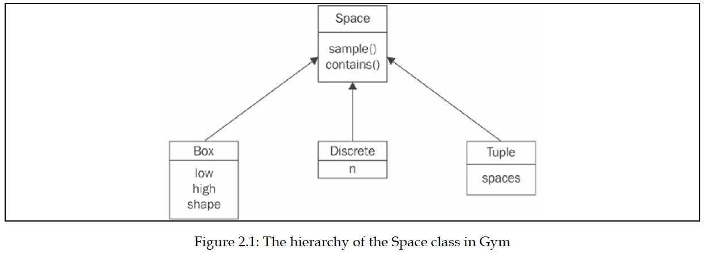
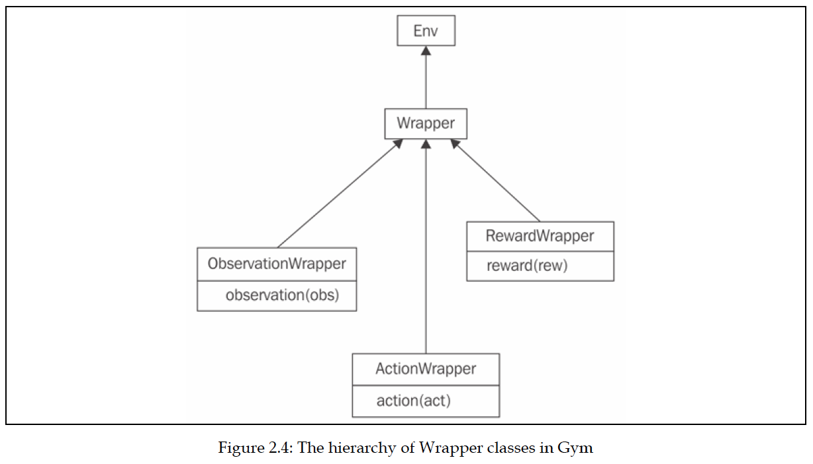

# Learning Gym Environments (OpenAI)

## Contents

- [The OpenAI Gym API](https://github.com/Arseni1919/Learning_Gym_OpenAI#the-openai-gym-api)
- [The action space](https://github.com/Arseni1919/Learning_Gym_OpenAI#the-action-space)
- [The observation space](https://github.com/Arseni1919/Learning_Gym_OpenAI#the-observation-space)
- [Spaces](https://github.com/Arseni1919/Learning_Gym_OpenAI#spaces)
- [The environment](https://github.com/Arseni1919/Learning_Gym_OpenAI#the-environment)
- [The CartPole session](https://github.com/Arseni1919/Learning_Gym_OpenAI#the-cartpole-session)
- [Extra Gym functionality – wrappers and monitors](https://github.com/Arseni1919/Learning_Gym_OpenAI#extra-gym-functionality--wrappers-and-monitors)
- [Wrappers](https://github.com/Arseni1919/Learning_Gym_OpenAI#wrappers)
- [Monitor](https://github.com/Arseni1919/Learning_Gym_OpenAI#monitor)
- [Summary](https://github.com/Arseni1919/Learning_Gym_OpenAI#summary)
- [Credits](https://github.com/Arseni1919/Learning_Gym_OpenAI#credits)

--------

```python
#!/usr/bin/env python
# prints all the names of envs that we have
from gym import envs
envids = [spec.id for spec in envs.registry.all()]
counter = 0
for envid in sorted(envids):
    counter += 1
#     print(envid)
print(counter)
```

## The OpenAI Gym API

[(back)](https://github.com/Arseni1919/Learning_Gym_OpenAI#contents)

The Python library called Gym was developed and has been maintained by OpenAI ([www.openai.com](https://www.openai.com/)).
The main goal of Gym is to provide a rich collection of environments for RL experiments using a unified interface.
So, it is not surprising that the central class in the library is an environment, which is called Env.
Instances of this class expose several methods and fields that provide the required information about its capabilities.
At a high level, every environment provides these pieces of information and functionality:

- A set of actions that is allowed to be executed in the environment. Gym supports both discrete and continuous actions, as well as their combination

- The shape and boundaries of the observations that the environment provides the agent with

- A method called step to execute an action, which returns the current observation, the reward, and the indication that the episode is over

- A method called reset, which returns the environment to its initial state and obtains the first observation

Let's now talk about these components of the environment in detail.

### The action space

[(back)](https://github.com/Arseni1919/Learning_Gym_OpenAI#contents)

As mentioned, the actions that an agent can execute can be discrete, continuous, or
a combination of the two. Discrete actions are a fixed set of things that an agent can
do, for example, directions in a grid like left, right, up, or down. Another example
is a push button, which could be either pressed or released. Both states are mutually
exclusive, because a main characteristic of a discrete action space is that only one
action from a finite set of actions is possible.
A continuous action has a value attached to it, for example, a steering wheel, which
can be turned at a specific angle, or an accelerator pedal, which can be pressed with
different levels of force. A description of a continuous action includes the boundaries
of the value that the action could have. In the case of a steering wheel, it could be
from −720 degrees to 720 degrees. For an accelerator pedal, it's usually from 0 to 1.
Of course, we are not limited to a single action; the environment could take multiple
actions, such as pushing multiple buttons simultaneously or steering the wheel and
pressing two pedals (the brake and the accelerator). To support such cases, Gym
defines a special container class that allows the nesting of several action spaces into
one unified action.

### The observation space

[(back)](https://github.com/Arseni1919/Learning_Gym_OpenAI#contents)

Observations are pieces of information that an environment provides the agent with, on every timestamp, besides the reward.
Observations can be as simple as a bunch of numbers or as complex as several multidimensional tensors containing color images from several cameras.
An observation can even be discrete, much like action spaces.
An example of a discrete observation space is a lightbulb, which could be in two states – on or off, given to us as a Boolean value.

### Spaces

[(back)](https://github.com/Arseni1919/Learning_Gym_OpenAI#contents)

So, you can see the similarity between actions and observations, and how they have found their representation in Gym's classes.
Let's look at a class diagram:



The basic abstract class Space includes two methods that are relevant to us:

- `sample()`: This returns a random sample from the space

- `contains(x)`: This checks whether the argument, x, belongs to the space's
domain

Both of these methods are abstract and reimplemented in each of the Space
subclasses:

- The `Discrete` class represents a mutually exclusive set of items, numbered
from 0 to n – 1. Its only field, `n`, is a count of the items it describes. For
example, `Discrete(n=4)` can be used for an action space of four directions
to move in `[left, right, up, or down]`.

- The `Box` class represents an n-dimensional tensor of rational numbers
with intervals `[low, high]`. For instance, this could be an accelerator pedal
with one single value between 0.0 and 1.0, which could be encoded by
`Box(low=0.0, high=1.0, shape=(1,), dtype=np.float32)`(the `shape`
argument is assigned a tuple of length 1 with a single value of 1, which
gives us a one-dimensional tensor with a single value). The `dtype` parameter
specifies the space's value type and here we specify it as a NumPy 32-bit
float. Another example of `Box` could be an Atari screen observation (we
will cover lots of Atari environments later), which is an RGB (red, green,
and blue) image of size 210×160: `Box(low=0, high=255, shape=(210, 160,
3), dtype=np.uint8)`. In this case, the `shape` argument is a tuple of three
elements: the first dimension is the height of the image, the second is the
width, and the third equals 3, which all correspond to three color planes
for red, green, and blue, respectively. So, in total, every observation is
a three-dimensional tensor with 100,800 bytes.

- The final child of `Space` is a `Tuple` class, which allows us to combine
several Space class instances together. This enables us to create action
and observation spaces of any complexity that we want. For example,
imagine we want to create an action space specification for a car. The car
has several controls that can be changed at every timestamp, including the
steering wheel angle, brake pedal position, and accelerator pedal position.
These three controls can be specified by three float values in one single `Box`
instance. Besides these essential controls, the car has extra discrete controls,
like a turn signal (which could be off, right, or left) or horn (on or off). To
combine all of this into one action space specification class, we can create
`Tuple(spaces=(Box(low=-1.0, high=1.0, shape=(3,), dtype=np.
float32), Discrete(n=3),Discrete(n=2)))`. This flexibility is rarely used;
for example, in this book, you will see only the Box and Discrete actions
and observation spaces, but the Tuple class can be useful in some cases.

------

There are other Space subclasses defined in Gym, but the preceding three are the
most useful ones. All subclasses implement the `sample()` and `contains()` methods.
The `sample()` function performs a random sample corresponding to the `Space` class
and parameters. This is mostly useful for action spaces, when we need to choose the
random action. The `contains()` method verifies that the given arguments comply
with the `Space` parameters, and it is used in the internals of Gym to check an agent's
actions for sanity. For example, `Discrete.sample()` returns a random element from
a discrete range, and `Box.sample()` will be a random tensor with proper dimensions
and values lying inside the given range.

Every environment has two members of type `Space`: the action_space and
observation_space. This allows us to create generic code that could work with
any environment. Of course, dealing with the pixels of the screen is different from
handling discrete observations (as in the former case, we may want to preprocess
images with convolutional layers or with other methods from the computer vision
toolbox); so, most of the time, this means optimizing the code for a particular
environment or group of environments, but Gym doesn't prevent us from writing
generic code.

------

### The environment

[(back)](https://github.com/Arseni1919/Learning_Gym_OpenAI#contents)

The environment is represented in Gym by the `Env` class, as mentioned earlier, which
has the following members:

- `action_space`: This is the field of the `Space` class and provides
a specification for allowed actions in the environment.

- `observation_space`: This field has the same `Space` class, but specifies the
observations provided by the environment.

- `reset()`: This resets the environment to its initial state, returning the initial
observation vector.

- `step()`: This method allows the agent to take the action and returns
information about the outcome of the action – the next observation, the local
reward, and the end-of-episode flag. This method is a bit complicated and we
we will look at it in detail later in this section.

There are extra utility methods in the `Env` class, such as `render()`, which allows
us to obtain the observation in a human-friendly form, but we won't use them. You
can find the full list in Gym's documentation, but let's focus on the core Env methods:
`reset()` and `step()`.

So far, you have seen how our code can get information about the environment's
actions and observations, so now you need to get familiar with actioning itself.
Communications with the environment are performed via step and reset.

#### `reset()` and `step()`

As `reset` is much simpler, we will start with it. The `reset()` method has no
arguments; it instructs an environment to reset into its initial state and obtain
the initial observation. Note that you have to call `reset()` after the creation of
the environment. As you may remember from Chapter 1, What Is Reinforcement
Learning?, the agent's communication with the environment may have an end (like
a "Game Over" screen). Such sessions are called episodes, and after the end of the
episode, an agent needs to start over. The value returned by this method is the first
observation of the environment.

The `step()` method is the central piece in the environment's functionality. It does
several things in one call, which are as follows:

- Telling the environment which action we will execute on the next step

- Getting the new observation from the environment after this action

- Getting the reward the agent gained with this step

- Getting the indication that the episode is over

The first item (action) is passed as the only argument to this method, and the rest are
returned by the `step()` method. Precisely, this is a tuple (Python `tuple` and not the
`Tuple` class we discussed in the previous section) of four elements (observation,
reward, done, and info). They have these types and meanings:

- `observation`: This is a NumPy vector or a matrix with observation data.

- `reward`: This is the float value of the reward.

- `done`: This is a Boolean indicator, which is True when the episode is over.

- `info`: This could be anything environment-specific with extra information
about the environment. The usual practice is to ignore this value in general
RL methods (not taking into account the specific details of the particular
environment).

You may have already got the idea of environment usage in an agent's code – in
a loop, we call the `step()` method with an action to perform until this method's
done flag becomes True. Then we can call `reset()` to start over. There is only one
piece missing – how we create `Env` objects in the first place.

### Creating an environment

[(back)](https://github.com/Arseni1919/Learning_Gym_OpenAI#contents)

Every environment has a unique name of the EnvironmentName-vN form,
where N is the number used to distinguish between different versions of the same
environment (when, for example, some bugs get fixed or some other major changes
are made). To create an environment, the gym package provides the make(env_name)
function, whose only argument is the environment's name in string form.
At the time of writing, Gym version 0.13.1 contains 859 environments with different
names. Of course, all of those are not unique environments, as this list includes all
versions of an environment. Additionally, the same environment can have different
variations in the settings and observations spaces. For example, the Atari game
Breakout has these environment names:

- Breakout-v0, Breakout-v4: The original Breakout with a random initial
position and direction of the ball

- BreakoutDeterministic-v0, BreakoutDeterministic-v4: Breakout with the
same initial placement and speed vector of the ball

- BreakoutNoFrameskip-v0, BreakoutNoFrameskip-v4: Breakout with every
frame displayed to the agent

- Breakout-ram-v0, Breakout-ram-v4: Breakout with the observation of the full
Atari emulation memory (128 bytes) instead of screen pixels

- Breakout-ramDeterministic-v0, Breakout-ramDeterministic-v4

- Breakout-ramNoFrameskip-v0, Breakout-ramNoFrameskip-v4

Even after the removal of such duplicates, Gym 0.13.1 comes with an impressive list
of 154 unique environments, which can be divided into several groups:
- Classic control problems: These are toy tasks that are used in optimal control
theory and RL papers as benchmarks or demonstrations. They are usually
simple, with low-dimension observation and action spaces, but they are
useful as quick checks when implementing algorithms. Think about them as
the "MNIST for RL" (MNIST is a handwriting digit recognition dataset from
Yann LeCun, which you can find at http://yann.lecun.com/exdb/mnist/).

- Atari 2600: These are games from the classic game platform from the 1970s.
There are 63 unique games.

- Algorithmic: These are problems that aim to perform small computation
tasks, such as copying the observed sequence or adding numbers.

- Board games: These are the games of Go and Hex.

- Box2D: These are environments that use the Box2D physics simulator to
learn walking or car control.

- MuJoCo: This is another physics simulator used for several continuous
control problems.

- Parameter tuning: This is RL being used to optimize NN parameters.

- Toy text: These are simple grid world text environments.

- PyGame: These are several environments implemented using the PyGame
engine.

- Doom: These are nine mini-games implemented on top of ViZDoom.

The full list of environments can be found at https://gym.openai.com/envs or on
the wiki page in the project's GitHub repository. An even larger set of environments
is available in OpenAI Universe (currently discontinued by OpenAI), which provides
general connectors to virtual machines while running Flash and native games, web
browsers, and other real-world applications. OpenAI Universe extends the Gym
API, but it follows the same design principles and paradigm. You can check it
out at https://github.com/openai/universe. We will deal with Universe more
closely in Chapter 13, Asynchronous Advantage Actor-Critic, in terms of MiniWoB and
browser automation.
Enough theory! Let's now look at a Python session working with one of Gym's
environments.

###  The CartPole session

[(back)](https://github.com/Arseni1919/Learning_Gym_OpenAI#contents)

Let's apply our knowledge and explore one of the simplest RL environments that
Gym provides.

```python
import gym
e = gym.make('CartPole-v0')
```

Here, we have imported the gym package and created an environment called
CartPole. This environment is from the classic control group and its gist is to control
the platform with a stick attached by its bottom part. The trickiness is that this stick tends to fall right or left and you need to balance it by
moving the platform to the right or left on every step.

The observation of this environment is four floating-point numbers containing
information about the x coordinate of the stick's center of mass, its speed, its angle to
the platform, and its angular speed. Of course, by applying some math and physics
knowledge, it won't be complicated to convert these numbers into actions when
we need to balance the stick, but our problem is this – how do we learn to balance
this system without knowing the exact meaning of the observed numbers and only
by getting the reward? The reward in this environment is 1, and it is given on every
time step. The episode continues until the stick falls, so to get a more accumulated
reward, we need to balance the platform in a way to avoid the stick falling.

```python
obs = e.reset()
obs
array([-0.02282826,  0.04299016, -0.01328164,  0.03404807])
```

Here, we reset the environment and obtained the first observation (we always need
to reset the newly created environment). As I said, the observation is four numbers,
so let's check how we can know this in advance.

```python
e.action_space
Discrete(2)
```

```python
e.observation_space
Box(4,)
```

The `action_space` field is of the `Discrete` type, so our actions will be just 0 or
1, where 0 means pushing the platform to the left and 1 means to the right. The
observation space is of `Box(4,)`, which means a vector of size 4 with values inside
the [−inf, inf] interval.

```python
e.step(0)
(array([-0.02196845, -0.15193883, -0.01260068,  0.32251109]), 1.0, False, {})
```

Here, we pushed our platform to the left by executing the action 0 and got the tuple
of four elements:

- A new observation, which is a new vector of four numbers

- A reward of 1.0

- The done flag with value False, which means that the episode is not over yet
and we are more or less okay

- Extra information about the environment, which is an empty dictionary

Next, we will use the `sample()` method of the `Space` class on the `action_space` and
`observation_space`.

```python
e.action_space.sample()
0
```

```python
e.observation_space.sample()
array([-4.14162111e+00,  2.52167081e+38, -1.13946825e-01,  1.37168161e+38],
      dtype=float32)
```

```python
e.observation_space.sample()
array([-6.9581592e-01,  1.6188469e+38, -4.4360504e-02, -3.3248585e+38],
      dtype=float32)
```

This method returned a random sample from the underlying space, which in the
case of our `Discrete` action space means a random number of 0 or 1, and for the
observation space means a random vector of four numbers. The random sample
of the observation space may not look useful, and this is true, but the sample from
the action space could be used when we are not sure how to perform an action. This
feature is especially handy because you don't know any RL methods yet, but we still
want to play around with the Gym environment. Now that you know enough to
implement your first randomly behaving agent for CartPole, let's do it.

### The random CartPole agent

Although the environment is much more complex than our first example in
The anatomy of the agent section, the code of the agent is much shorter. This is the
power of reusability, abstractions, and third-party libraries!
So, here is the code:

```python
env = gym.make("CartPole-v0")
total_reward = 0.0
total_steps = 0
obs = env.reset()
```

Here, we created the environment and initialized the counter of steps and the reward
accumulator. On the last line, we reset the environment to obtain the first observation
(which we will not use, as our agent is stochastic).

```python
while True:
    action = env.action_space.sample()
    obs, reward, done, _ = env.step(action)
    total_reward += reward
    total_steps += 1
    if done:
        break
print("Episode done in %d steps, total reward %.2f" % (total_steps, total_reward))

Episode done in 10 steps, total reward 10.00
```

In this loop, we sampled a random action, then asked the environment to execute
it and return to us the next observation (obs), the reward, and the done flag. If the
episode is over, we stop the loop and show how many steps we have taken and
how much reward has been accumulated.

## Extra Gym functionality – wrappers and monitors

[(back)](https://github.com/Arseni1919/Learning_Gym_OpenAI#contents)

What we have discussed so far covers two-thirds of the Gym core API and the
essential functions required to start writing agents. The rest of the API you can live
without, but it will make your life easier and your code cleaner. So, let's briefly cover
the rest of the API.

## Wrappers

[(back)](https://github.com/Arseni1919/Learning_Gym_OpenAI#contents)

Very frequently, you will want to extend the environment's functionality in some
generic way. For example, imagine an environment gives you some observations,
but you want to accumulate them in some buffer and provide to the agent the N
last observations. This is a common scenario for dynamic computer games, when
one single frame is just not enough to get the full information about the game state.
Another example is when you want to be able to crop or preprocess an image's
pixels to make it more convenient for the agent to digest, or if you want to normalize
reward scores somehow. There are many such situations that have the same
structure – you want to "wrap" the existing environment and add some extra logic
for doing something. Gym provides a convenient framework for these situations –
the `Wrapper` class.

The class structure is shown in the following diagram.



The `Wrapper` class inherits the Env class. Its constructor accepts the only argument
– the instance of the `Env` class to be "wrapped." To add extra functionality, you need
to redefine the methods you want to extend, such as `step()` or `reset()`. The only
requirement is to call the original method of the superclass.
To handle more specific requirements, such as a `Wrapper` class that wants to
process only observations from the environment, or only actions, there are subclasses
of `Wrapper` that allow the filtering of only a specific portion of information. They are
as follows:

- `ObservationWrapper`: You need to redefine the observation (obs) method
of the parent. The obs argument is an observation from the wrapped
environment, and this method should return the observation that will
be given to the agent.

- `RewardWrapper`: This exposes the reward (rew) method, which can modify
the reward value given to the agent.

- `ActionWrapper`: You need to override the action (act) method, which can
tweak the action passed to the wrapped environment by the agent.

To make it slightly more practical, let's imagine a situation where we want to
intervene in the stream of actions sent by the agent and, with a probability of 10%,
replace the current action with a random one. It might look like an unwise thing
to do, but this simple trick is one of the most practical and powerful methods for
solving the exploration/exploitation problem that I mentioned briefly in Chapter 1,
What Is Reinforcement Learning?. By issuing the random actions, we make our agent
explore the environment and from time to time drift away from the beaten track of
its policy. This is an easy thing to do using the `ActionWrapper` class (a full example
is in Chapter02/03_random_action_wrapper.py).

```python
import gym
from typing import TypeVar
import random

Action = TypeVar('Action')

class RandomActionWrapper(gym.ActionWrapper):

    def __init__(self, env, epsilon=0.1):
        super(RandomActionWrapper, self).__init__(env)
        self.epsilon = epsilon

    def action(self, action: Action) -> Action:
        if random.random() < self.epsilon:
            print("Random!")
            return self.env.action_space.sample()
        return action
```

Here, we initialized our wrapper by calling a parent's `__init__` method and saving
epsilon (the probability of a random action). This is a method that we need to override from a parent's class to tweak the agent's
actions. Every time we roll the die, and with the probability of epsilon, we sample a
random action from the action space and return it instead of the action the agent has
sent to us. Note that using `action_space` and wrapper abstractions, we were able to
write abstract code, which will work with any environment from Gym. Additionally,
we must print the message every time we replace the action, just to verify that our
wrapper is working. In the production code, of course, this won't be necessary.

```python
env = RandomActionWrapper(gym.make("CartPole-v0"))
```

Now it's time to apply our wrapper. We will create a normal CartPole environment
and pass it to our `Wrapper` constructor. From here on, we will use our wrapper as
a normal `Env` instance, instead of the original CartPole. As the `Wrapper` class inherits
the `Env` class and exposes the same interface, we can nest our wrappers in any
combination we want. This is a powerful, elegant, and generic solution.)

```python
obs = env.reset()
total_reward = 0.0
while True:
    obs, reward, done, _ = env.step(0)
    total_reward += reward
    if done:
        break
print("Reward got: %.2f" % total_reward)

Reward got: 8.00
```

Here is almost the same code, except that every time we issue the same action, 0,
our agent is dull and does the same thing. By running the code, you should see that
the wrapper is indeed working.

If you want, you can play with the epsilon parameter on the wrapper's creation
and verify that randomness improves the agent's score on average.
We should move on now and look at another interesting gem that is hidden inside
Gym: `Monitor`.

### Monitor

[(back)](https://github.com/Arseni1919/Learning_Gym_OpenAI#contents)

Another class that you should be aware of is `Monitor`. It is implemented like
`Wrapper` and can write information about your agent's performance in a file, with
an optional video recording of your agent in action.


```python
env = gym.make("CartPole-v0")
env = gym.wrappers.Monitor(env, "recording")
```

The second argument that we pass to `Monitor` is the name of the directory that it will
write the results to. This directory shouldn't exist, otherwise your program will fail
with an exception (to overcome this, you could either remove the existing directory
or pass the `force=True` argument to the `Monitor` class' constructor).
The `Monitor` class requires the FFmpeg utility to be present on the system, which
is used to convert captured observations into an output video file. This utility must
be available, otherwise `Monitor` will raise an exception.

The easiest way to install
FFmpeg is using your system's package manager, which is OS distribution-specific.

-------

## Summary

[(back)](https://github.com/Arseni1919/Learning_Gym_OpenAI#contents)

You have started to learn about the practical side of RL! In this chapter, we installed
OpenAI Gym, with its tons of environments to play with. We studied its basic API
and created a randomly behaving agent.
You also learned how to extend the functionality of existing environments in
a modular way and became familiar with a way to record our agent's activity
using the Monitor class. This will be heavily used in the upcoming chapters.
In the next chapter, we will do a quick DL recap using PyTorch, which is a favorite
library among DL researchers. Stay tuned.


## Credits

[(back)](https://github.com/Arseni1919/Learning_Gym_OpenAI#contents)

- [Gym OpenAI wiki | GitHub](https://github.com/openai/gym/wiki)
- [Environments | OpenAI](http://gym.openai.com/envs/#classic_control)
- [Docs | OpenAI](http://gym.openai.com/docs/)
- [Creating new Gym Env | OpenAI](https://github.com/openai/gym/blob/master/docs/creating-environments.md)
- [Create custom gym environments from scratch — A stock market example | Adam King](https://towardsdatascience.com/creating-a-custom-openai-gym-environment-for-stock-trading-be532be3910e)
- [Deep-Reinforcement-Learning-Hands-On-Second-Edition | Packt](https://github.com/PacktPublishing/Deep-Reinforcement-Learning-Hands-On-Second-Edition)


